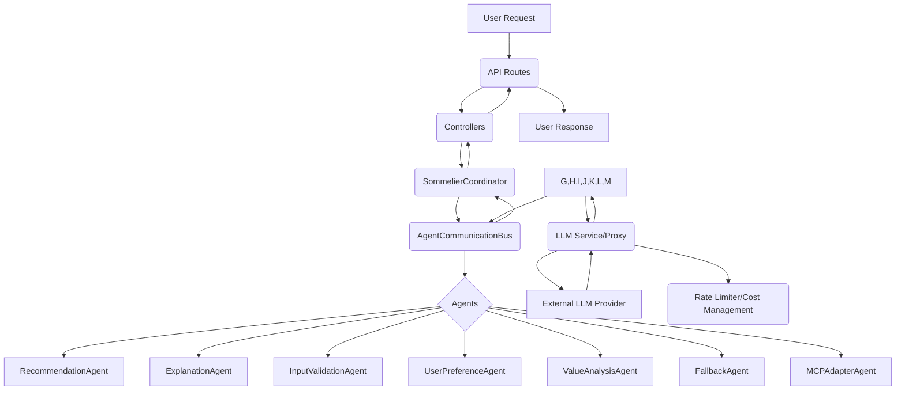

# LLM Integration Plan

This plan outlines the steps for integrating Language Model (LLM) capabilities into the agentic AI architecture to enhance various agent functions.

## Proposed Architecture

## Detailed Steps

1.  **Design and Implement LLM Access Layer:**
    *   Create a new service (e.g., `LLMService.ts`) or utility module responsible for interacting with the chosen LLM provider (API calls, handling authentication, etc.).
    *   This layer should abstract the specifics of the LLM provider, allowing for potential future changes or additions of different LLMs.
    *   Implement basic error handling and potentially retry mechanisms for LLM calls.

2.  **Integrate LLM Access into Agent Communication:**
    *   Determine how agents will request LLM interactions. A centralized approach, possibly through a dedicated `LLMService` or an `LLMAgent` acting as a proxy, is recommended for managing LLM resources and decoupling agents from the LLM provider specifics.

3.  **Modify Agents to Utilize LLM:**
    *   Identify the specific points within each relevant agent's logic where LLM interaction is needed (e.g., `RecommendationAgent` for refining recommendations, `ExplanationAgent` for generating explanations, `InputValidationAgent` for understanding user queries, `SommelierCoordinator` for complex reasoning).
    *   Implement the logic within these agents to formulate prompts for the LLM based on the agent's context and the task at hand.
    *   Handle the LLM's response, parsing it and integrating the information back into the agent's workflow.

4.  **Address Cross-Cutting Concerns:**
    *   Implement rate limiting for LLM calls to avoid exceeding provider limits and managing costs.
    *   Consider cost tracking for LLM usage.
    *   Implement robust parsing and validation of LLM responses.

5.  **Testing:**
    *   Write unit tests for the LLM access layer.
    *   Write integration tests to verify agent-LLM interaction.
    *   Update end-to-end tests.

## Progress (Updated based on detailed code review)

*   **Step 1: Design and Implement LLM Access Layer:** Largely complete. `LLMService.ts` created and configured for Ollama with a configurable model.
*   **Step 2: Integrate LLM Access into Agent Communication:** Largely complete. `AgentCommunicationBus` modified and injected into `SommelierCoordinator`.
*   **Step 3: Modify Agents to Utilize LLM:** In progress. Integrated into `ExplanationAgent`, `RecommendationAgent`, `InputValidationAgent`, `UserPreferenceAgent`, `FallbackAgent`, and `ValueAnalysisAgent`.
*   **Step 4: Address Cross-Cutting Concerns:**
    *   Implement rate limiting for LLM calls: **Remaining** (No explicit implementation found).
    *   Consider cost tracking for LLM usage: **Completed** (Basic logging of prompt/response length exists).
    *   Implement robust parsing and validation of LLM responses: **Partially Completed** (Basic JSON parsing and structural checks in some agents, but not fully robust or comprehensive across all agents).
*   **Step 5: Testing:**
    *   Write unit tests for the LLM access layer: **Partially Completed** (Basic unit tests for `LLMService` exist, but might not be comprehensive).
    *   Write integration tests to verify agent-LLM interaction: **Remaining** (Existing tests mock the LLMService).
    *   Update end-to-end tests: **Partially Completed** (E2E tests exist for the recommendations endpoint which involves LLM interaction, but they don't specifically assert on the LLM's contribution or handle different LLM responses in detail).