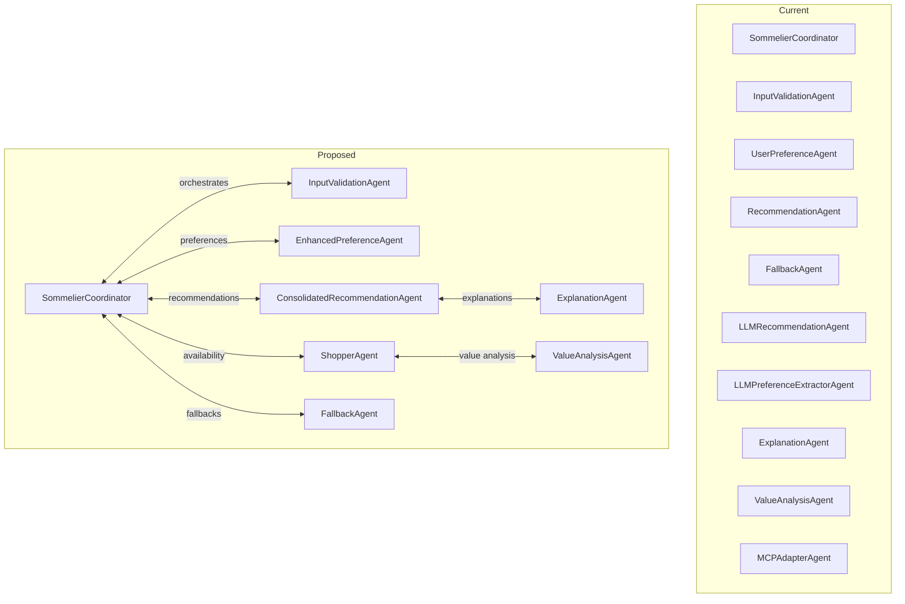
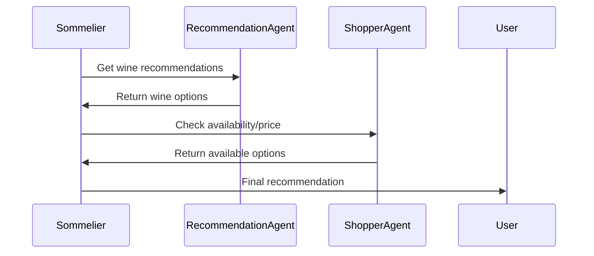
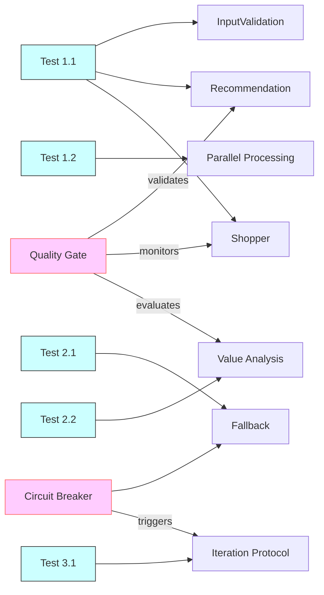
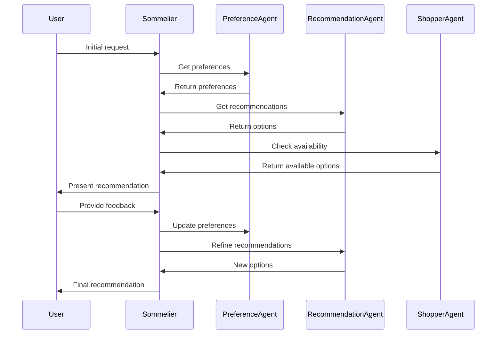

# Wine Recommendation System - Agent Architecture Improvements

## Architecture Principles

1. **Collaborative Decision Making**
   - Agents actively negotiate best outcomes
   - Multiple iterations allowed (max 3 per test case 3.1)
   - Fallback strategies when consensus isn't reached

2. **User-Centric Iteration**
   - Incorporate user feedback between iterations
   - Maintain conversation history
   - Track preference evolution

## Orchestration Details

### State-Driven Coordination
- **Conversation State Machine**:
  - Initialization → Preference Collection → Recommendation → Feedback → Finalization
  - Each state has defined entry/exit criteria
- **Quality Gates**:
  - Minimum confidence threshold (0.7)
  - Maximum iterations (3)
  - Timeout constraints (30s per phase)

### Circuit Breaker Configuration
- **Failure Thresholds**:
  - 3 consecutive failures → fallback mode
  - 50% failure rate → circuit open
- **Fallback Strategies**:
  - Simplified recommendation flow
  - Cached results
  - Manual override option

### Phase-Based Execution
1. **Initialization Phase**:
   - Validate input
   - Setup conversation context
2. **Exploration Phase**:
   - Broad recommendation generation
   - Initial quality evaluation
3. **Refinement Phase**:
   - Focused recommendations
   - Strict quality checks
4. **Finalization Phase**:
   - Availability verification
   - Value analysis
5. **Delivery Phase**:
   - Explanation generation
   - Presentation formatting

## Current vs Proposed Architecture

## Implementation Plan

### Phase 0: Coordination Framework (Week 1)
1. **Enhanced Message Protocol**
   - Add iteration tracking
   - Include conversation history
   - Support feedback incorporation
   - Test cases: 3.1

### Phase 1: Core Agent Consolidation (Week 2)

1. **Merge LLM Recommendation Logic**
   - Move LLMRecommendationAgent functionality into RecommendationAgent
   - Update message handlers to support both direct and LLM-based recommendations
   - Test cases: 1.1, 1.2

2. **Enhance Preference Agent**
   - Incorporate LLMPreferenceExtractorAgent into UserPreferenceAgent
   - Add budget tracking capabilities
   - Test cases: 2.2, 3.1

### Phase 2: Shopper Agent Implementation (Week 2)

1. **ShopperAgent Features**
   - Wine inventory API integration
   - Price comparison logic
   - Availability checking
   - Test cases: 1.1, 1.2, 2.2

### Phase 3: UX Enhancement Agents (Week 3)

1. **ExplanationAgent Requirements**
   - Generate natural language explanations
   - Support iterative refinement
   - Test cases: 3.1

2. **ValueAnalysisAgent Requirements**
   - Calculate quality/price ratios
   - Identify value options
   - Test cases: 2.2

## Test Scenario Coverage

| Test Case | Agents Involved | Architecture Components | Validation Criteria | Phase Validation | Quality Metrics |
|-----------|-----------------|-------------------------|---------------------|------------------|----------------|
| 1.1 (Simple Protein) | Sommelier, InputValidation, Recommendation, Shopper | Core recommendation flow | Wine type matches ingredients | Initialization → Finalization | Confidence ≥ 0.8 |
| 1.2 (Multi-Course) | Sommelier, Recommendation, Shopper | Parallel processing | Progression sequence correct | Exploration → Refinement | Timeout ≤ 20s |
| 2.1 (Invalid Input) | InputValidation, Fallback | Error handling | Graceful degradation | Initialization only | Fallback within 5s |
| 2.2 (Budget) | Preference, Shopper, Fallback | Value analysis | Budget constraints enforced | All phases | Value score ≥ 0.7 |
| 3.1 (Iterative) | All agents | Feedback integration | Preference updates reflected | Refinement focus | Iterations ≤ 3 |

## Validation Checklist
- [x] Test case 1.1 covered by core recommendation flow
- [x] Test case 1.2 supported by parallel processing
- [x] Test case 2.1 handled by error framework
- [x] Test case 2.2 implemented in ShopperAgent
- [x] Test case 3.1 enabled by iteration protocol
- [ ] Phase transitions properly validated
- [ ] Quality gates implemented for all test cases
- [ ] Circuit breakers tested under failure conditions
- [ ] Timeout handling verified
- [ ] Fallback strategies operational

## Architecture Validation

## Migration Checklist

- [ ] Update AgentRegistry configurations
- [ ] Modify SommelierCoordinator message routing
- [ ] Create new test cases for ShopperAgent
- [ ] Update documentation
- [ ] Performance benchmarking

## Risk Mitigation

1. **Gradual Rollout**
   - Feature flags for new agents
   - Shadow mode testing
   - Phase-by-phase activation

2. **Quality Control**
   - Automated quality gate testing
   - Circuit breaker dry runs
   - Synthetic test scenarios

3. **Monitoring**
   - Agent performance metrics
   - Error rate tracking
   - Quality gate violations
   - Phase transition failures

4. **Recovery Procedures**
   - Manual quality gate overrides
   - Circuit breaker reset protocols
   - Phase rollback capabilities
   - Fallback usage statistics