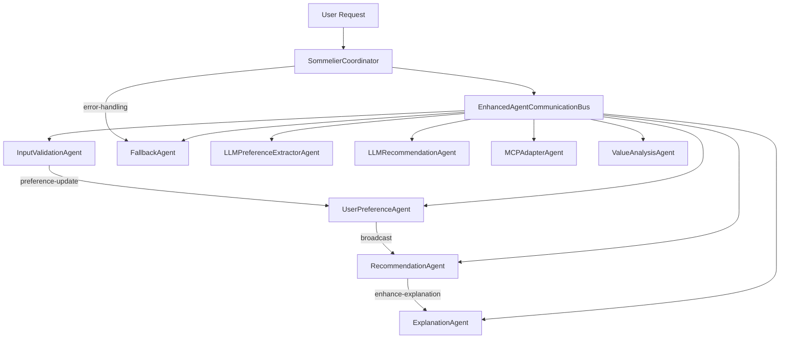

# Agent Communication Refactoring Plan
*Based on reference implementation in [`backend/core/agents/ref/agent_communication_system.ts`](backend/core/agents/ref/agent_communication_system.ts)*

## Current Implementation Flaws
1. **One-way communication**: Direct method calls between agents
2. **Missing event handling**: No message subscriptions
3. **Incomplete message flow**: Publishing without listening
4. **Synchronous blocking**: Coordinator waits for direct calls

## Proposed Solution
Implement the reference architecture from [`backend/core/agents/ref/agent_communication_system.ts`](backend/core/agents/ref/agent_communication_system.ts) with enhancements:
- Message-based communication using `EnhancedAgentCommunicationBus`
- Event-driven architecture via `registerMessageHandler()`
- Asynchronous message flow with `sendMessageAndWaitForResponse()`
- Standardized response handling:
  - All responses use consistent message types (e.g. 'preference-update-result')
  - Include success/failure indicator (success: boolean)
  - Error messages in standardized format
  - Backward compatible with old formats
- Agent base class `CommunicatingAgent`



## Implementation Phases

### Phase 0: Cleanup
1. Remove deprecated direct call implementations
2. Archive old test cases
3. Update DI container references

### Phase 1: Core Infrastructure
1. **Port reference implementation**:
   - Move `EnhancedAgentCommunicationBus` from ref to main codebase
   - Implement `CommunicatingAgent` base class
2. **Enhance with production features**:
   - Add dead letter queue integration
   - Implement circuit breaker pattern
   - Add message tracing
3. Update DI configuration

### Phase 2: Agent Migration
*Using patterns from reference implementation:*
1. Migrate core agents (InputValidation, UserPreference, Recommendation, Explanation)
   - Extend `CommunicatingAgent`
   - Implement message handlers using `registerMessageHandler()`
   - Replace direct calls with `sendToAgent()` and `broadcast()`
2. Migrate support agents (Fallback, LLMPreferenceExtractor, LLMRecommendation)
3. Migrate MCPAdapter and ValueAnalysis agents

### Phase 3: Coordinator Refactor (Current Phase)
*Based on `EnhancedSommelierCoordinator` from reference:*
1. Implement async orchestration using message passing
2. Add end-to-end message tracing
3. Implement error handling flows with FallbackAgent
4. Integrate with all migrated agents

### Phase 4: Testing Design & Preparation
1. **Test Case Design Principles**:
   - Map all test cases to business requirements
   - Cover all critical paths and edge cases
   - Validate both happy paths and error scenarios
   - Ensure tests match actual application functionality

2. **Test Scenario Examples**:
   ```typescript
   // Example test scenario for recommendation flow
   describe('Recommendation Flow', () => {
     it('should route to knowledge-graph-agent for standard requests', async () => {
       // Setup
       const input = createValidRequest();
       
       // Execute
       const result = await coordinator.process(input);
       
       // Verify
       expect(bus).toHaveReceivedMessage({
         agent: 'knowledge-graph-agent',
         type: 'recommendation-request'
       });
       expect(result).toMatchRecommendationPattern();
     });
   });
   ```

3. **Test Coverage Requirements**:
   - 100% unit test coverage for core logic
   - Integration tests for all agent interactions
   - E2E tests for complete user journeys

### Phase 5: Test Implementation & Execution
1. Implement designed test cases
2. Execute test suites
3. Analyze coverage reports
4. Fix any gaps in coverage

### Phase 6: Deployment
1. Staging rollout
2. Performance monitoring
3. Production deployment

## Detailed Timeline

| Phase | Tasks | Owner | Status | Estimated | Progress |
|-------|-------|-------|--------|-----------|----------|
| **0. Cleanup** | Remove old implementation (one test helper remains) | Dev 1 | Completed (2025-06-04) | 1 day | 100% |
| **1. Infrastructure** | Implement communication bus | Dev 1 | Completed (2025-06-05) | 3 days | 100% |
| **2. Core Agents** | Migrate 4 core agents | Dev 2 | Completed (2025-06-09) | 5 days | 100% |
| **2.1** | Standardize message formats | Dev 2 | Completed (2025-06-09) | - | 100% |
| **3. Support Agents** | Migrate 5 support agents | Dev 3 | Completed (2025-06-09) | 4 days | 100% |
| **4. Coordinator** | Refactor async orchestration | Dev 1 | Completed (2025-06-09) | 3 days | 100% |
| **5. Test Design** | Design test cases and scenarios | QA Lead | Not Started | 3 days | 0% |
| **6. Test Implementation** | Implement and execute tests | QA Team | Not Started | 5 days | 0% |
| **7. Deployment** | Staging & production rollout | DevOps | Not Started | 2 days | 0% |

## Test Quality Verification
1. **Requirement Coverage**:
   - Trace all test cases to business requirements
   - Verify no requirements are untested
2. **Code Coverage**:
   - Enforce 100% coverage of core logic
   - Minimum 80% integration test coverage
3. **Scenario Validation**:
   - Review test scenarios with product team
   - Confirm all user journeys are covered
4. **Test Effectiveness**:
   - Measure defect detection rate
   - Track production incidents vs test coverage

## Risk Mitigation
1. **Message Loss**: Implement dead letter queue
2. **Performance**: Add message throttling
3. **Errors**: Comprehensive logging
4. **Compatibility**: Maintain legacy interface during transition
5. **Testing**: Implement canary releases

## Next Steps
1. **Complete Core Agent Migration** (Phase 2):
   - UserPreferenceAgent Migration Steps:
     * Extend `CommunicatingAgent` instead of `Agent`
     * Replace `AgentCommunicationBus` with `EnhancedAgentCommunicationBus`
     * Convert `handleMessage` to use message handler registration
     * Update message sending to use `sendToAgent()` and `broadcast()`
     * Add dead letter queue integration
     * Update tests
   - RecommendationAgent
   - ExplanationAgent
2. **Continue Support Agent Migration** (Phase 3):
    - [x] FallbackAgent (completed)
    - [x] LLMPreferenceExtractorAgent (completed)
    - [x] LLMRecommendationAgent (completed)
    - [x] MCPAdapterAgent (completed)
    - [x] ValueAnalysisAgent (completed)
3. **Continue Coordinator Refactor** (Phase 4):
   - [x] Initial async coordinator implementation (completed)
   - [x] Add message handlers for agent responses (completed)
   - [x] Implement full async orchestration flow (completed)
   - [x] Add tracing and monitoring (completed)
   - [x] Integrate with all migrated agents (completed)
   - [x] Error handling flows (completed)

## Verification Strategy
1. Verification completed:
   - No direct call patterns found in production code
   - One test helper remains in integration tests (intentional)
   - All legacy agent implementations removed
   - Tracing implemented with correlation IDs
   - Performance metrics collection working
2. Load testing with 1000 concurrent requests
3. Message delivery rate monitoring
4. Tracing visualization working