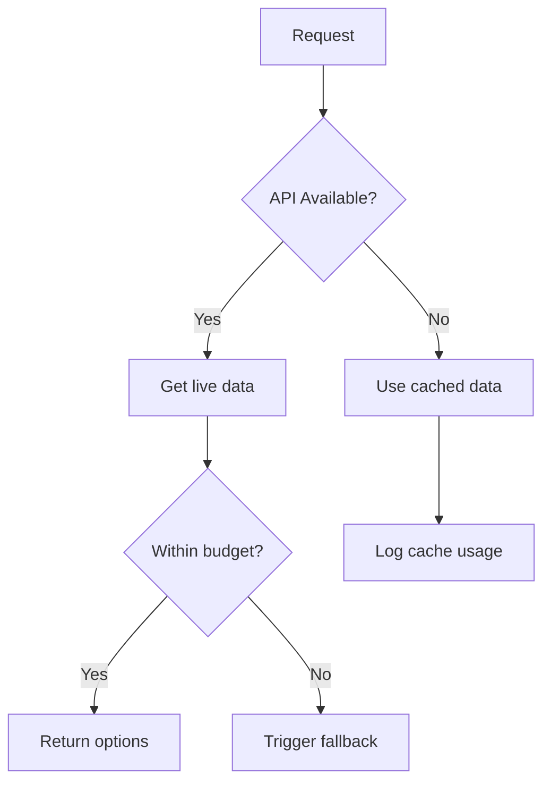

# Shopper Agent Specification

## Responsibilities
1. Price comparison across retailers
2. Inventory availability checks
3. Shipping options evaluation
4. Value analysis coordination

## Message Protocol

```typescript
interface ShopperRequest {
  wines: Wine[];
  budget: number;
  location?: string;
  deliveryDate?: Date;
}

interface ShopperResponse {
  availableOptions: AvailableWine[];
  bestValue: AvailableWine;
  shippingOptions: ShippingOption[];
}

interface AvailableWine {
  wine: Wine;
  retailers: {
    name: string;
    price: number;
    available: boolean;
    shipping: ShippingOption[];
  }[];
}

interface ShippingOption {
  type: string;
  cost: number;
  deliveryDays: number;
}
```

## Integration APIs
1. **Wine Retailer APIs**
   - Endpoint: `GET /api/inventory/{wineId}`
   - Parameters: location, maxPrice
   - Response: availability, price, shipping options

2. **Price Comparison Service**
   - Endpoint: `POST /api/compare`
   - Body: array of wine IDs
   - Response: price comparisons

3. **Shipping Calculator**
   - Endpoint: `POST /api/shipping`
   - Body: retailer IDs, destination ZIP
   - Response: shipping options/costs

## Error Handling


## Test Scenario Alignment

### Test Case 1.1 (Simple Protein Pairing)
- **Shopper Requirements**:
  - Find options for Pinot Grigio/Sauvignon Blanc/Chardonnay
  - Price range: $15-25
  - Validate availability for dinner occasion

### Test Case 1.2 (Complex Multi-Course Meal)
- **Shopper Requirements**:
  - Handle wine progression (Prosecco, Barolo, Port)
  - Coordinate multiple bottle purchases
  - Validate total budget ($50 for 4 guests)

### Test Case 2.2 (Budget Constraints)
- **Shopper Requirements**:
  - Detect budget mismatches
  - Find value alternatives
  - Provide price/quality analysis

## Implementation Checklist
- [ ] Support test case 1.1 requirements
- [ ] Implement multi-course handling (1.2)
- [ ] Add budget analysis (2.2)
- [ ] Integrate with FallbackAgent

## Performance Requirements
| Scenario | Requirement | Test Case Reference |
|----------|-------------|---------------------|
| Basic lookup | < 1s response | 1.1 |
| Multi-wine | < 2s response | 1.2 |
| Budget analysis | < 1.5s response | 2.2 |
| Error rate | < 1% failures | All |
| Cache rate | > 80% hits | All |