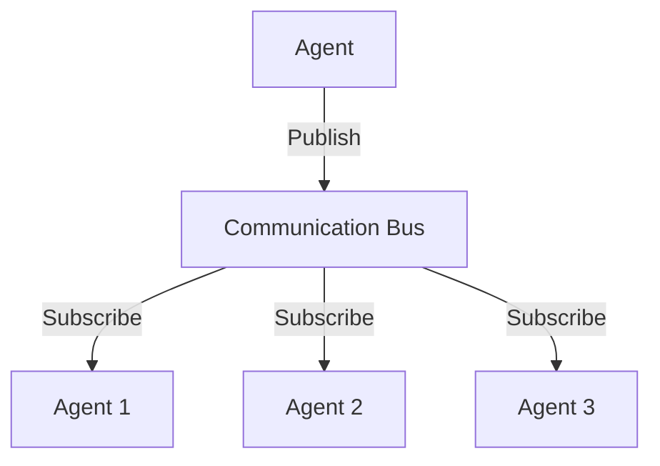

# Agent Communication Bus Implementation Plan

## Overview
Implement in-memory communication system using Node.js EventEmitter as foundation for agent coordination.

## Architecture


## Message Schema
```typescript
export type MessagePriority = 'HIGH' | 'NORMAL';

export interface AgentMessage<T = unknown> {
  metadata: {
    traceId: string;
    priority: MessagePriority;
    timestamp: number;
    sender: string;
  };
  payload: T;
  type: string;
}
```

## Implementation Steps

1. **Core Bus Class**
```typescript
class AgentCommunicationBus {
  private emitter: EventEmitter;
  private agents: Map<string, AgentInfo>;

  constructor() {
    this.emitter = new EventEmitter();
    this.agents = new Map();
  }
}
```

2. **Registration System**
- Agent registration with health checks
- Discovery mechanism
- Metadata storage

3. **Pub/Sub System**
- Topic-based subscriptions (e.g. 'message:wine', 'message:user')
- Subscription tracking per agent
- Message filtering by topic and type
- Error handling with circuit breaker
- Type-safe message handling

4. **Integration Points**
- Connect to RecommendationService
- Interface with KnowledgeGraphService
- Support existing rate limiting

## Testing Approach
1. Unit tests for core bus functionality
2. Integration tests with mock agents
3. Performance benchmarks
4. Error scenario testing

## Future Enhancements
1. Redis backend for scaling
2. PostgreSQL for persistence
3. MQTT for distributed systems