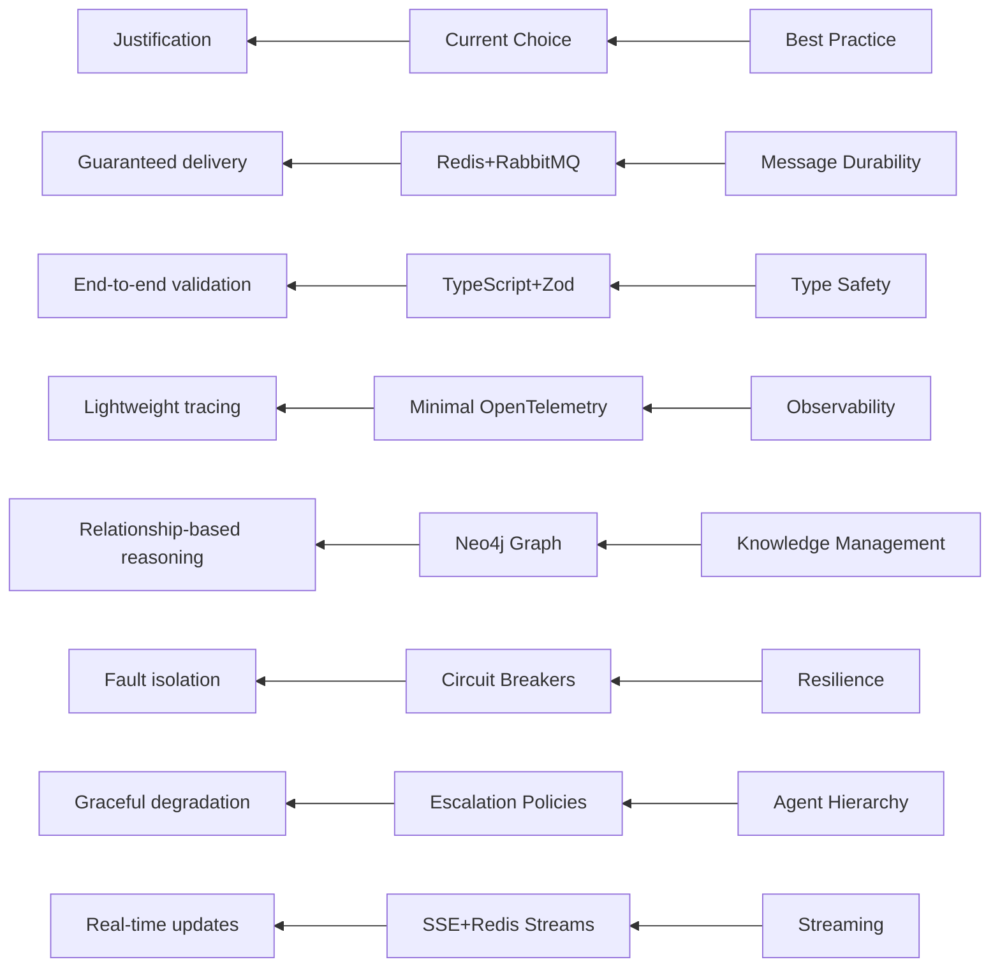

# Wine Recommendation App - Architecture Summary (Updated)

## Current System (LLM-Driven Agent Architecture)
```mermaid
graph TD
    subgraph User Interface
        FE[Frontend (Next.js)]
    end

    subgraph Backend (Node.js)
        API[API Route (/api/chat)]
        RateLimit[Rate Limiter]
        AgentSys[LLMDrivenAgentSystem]
        Orchestrator(LLM Orchestrator)
        AgentReg[Agent Registry]
        AgentBus[Agent Communication Bus]
        Context[Shared Context Memory]
        DB[(Database)]
        DI[DI Container (tsyringe)]
        Services[Services (Ollama, Cache, etc.)]
    end

    subgraph Agents
        SA[SommelierAgent]
        MCPA[MCPAdapterAgent]
    end
    
    subgraph External
        BuyerMCP[(Buyer Agent MCP Server)]
    end

    FE -->|HTTP| API
    API -->|Rate Limited| RateLimit
    API -->|AgentMessage| AgentSys
    AgentSys -->|ContextModel| Orchestrator
    Orchestrator -->|Decision| Services
    Orchestrator -->|Tool| AgentReg --> SA & MCPA
    AgentReg -->|Register| AgentBus
    AgentBus -->|Subscribe| Context
    MCPA -->|MCP| BuyerMCP
    API -->|Save| DB
    
    %% New Memory and Streaming Components
    AgentSys --> Memory[Context Memory System]
    Memory -->|Persistent| DB
    Memory -->|Ephemeral| Redis[(Redis Streams)]
    API --> SSE[Server-Sent Events]
```

## Key Components
1. **Frontend**: Next.js 14 + React + Tailwind CSS
2. **Core System**:
   - `LLMDrivenAgentSystem`: Main orchestrator (uses `LLMOrchestrator` internally)
   - `AgentRegistry`: Discovers and manages agents
   - `DynamicDecisionParser`: Handles LLM action parsing
   - `KnowledgeGraphService`: Manages wine relationships
3. **Agents**:
   - `RecommendationAgent`: Core wine pairing suggestions
   - `ValueAnalysisAgent`: Price/availability evaluation
   - `UserPreferenceAgent`: Handles constraints/allergies
   - `InputValidationAgent`: Input quality/ambiguity resolution
   - `ExplanationAgent`: Wine education responses
   - `FallbackAgent`: Graceful degradation handler
   - `SommelierCoordinator`: Lightweight orchestration
   - `MCPAdapterAgent`: Bridges to MCP servers
3. **Resilience**:
   - `RateLimiter`: API request throttling
     - 100 requests/15 minutes per endpoint per IP
     - Standard headers (RateLimit-*)
     - Custom 429 responses
   - `CircuitBreaker`: Protects external services
     - States: Closed (initial), Open, Half-Open
     - Events: Emits state changes (open, half-open, closed)
     - Note: Initial closed state is not emitted
   - `RetryManager`: Sophisticated retry policies
   - `DeadLetterProcessor`: Failed message analysis
4. **Services**:
   - `McpClientService`: MCP communication
   - `OllamaService`: LLM integration
   - `CacheService`: Performance optimization

## Enhanced Agentic Patterns
1. **Agent Communication Bus**:
   - Pub/sub model for agent coordination
   - Supports direct and broadcast messaging
   - Message persistence for audit trails

2. **Shared Context Memory**:
   - Short-term: Redis-based working memory
   - Long-term: Vector database for knowledge retention
   - Context versioning and snapshotting

3. **LLM Reasoning Protocols**:
   - Chain-of-thought prompting
   - Reflection and self-critique steps
   - Confidence scoring for decisions

## Communication Patterns
- **Agent Messaging**:
  ```typescript
  interface AgentEnvelope<T> {
    metadata: {
      traceId: string;
      priority: 'HIGH' | 'NORMAL';
      expiration?: Date;
      correlationId: string; // Added for distributed tracing
    };
    payload: T;
  }
  ```
- **Message Queues**:
  - Redis Streams for high-throughput operations
  - RabbitMQ for complex routing needs
  - Message TTL policies for automatic expiration
- **MCP Integration**:
  - TLS 1.3 encrypted channels
  - Protobuf serialization
- **Error Handling**:
  - Circuit breakers with half-open state monitoring
  - Tiered retry policies (immediate, delayed, final attempt)
  - Error classification (recoverable vs fatal)
- **Observability**:
  - Structured logging with minimal OpenTelemetry API
  - Performance metrics (decision latency, error rates)
  - Basic tracing spans for agent workflows

## Technical Validation


## Implementation Status
- **Phase**: Core Implementation
- **Current State**:
  - RecommendationService fully implemented with tests
  - KnowledgeGraphService implemented with Neo4j integration
  - Basic recommendation ranking working
  - Test coverage for core functionality
  - Tech stack validated and in use
  - Initial API endpoints operational

## Remaining Tasks
1. **Core Implementation**:
   - Knowledge Graph integration (Neo4j)
   - Agent hierarchy with fallback escalation
   - Message queue infrastructure
2. **Resilience**:
   - Circuit breaker implementation
   - Tiered retry policies
   - Dead letter queue processing
3. **Observability**:
   - Basic tracing implementation
   - Performance metric dashboards
   - Structured logging
4. **Agent Development**:
   - ExplanationAgent knowledge base
   - FallbackAgent degradation scenarios
5. **Deployment**:
   - Containerization with Docker
   - Monitoring for knowledge graph performance
   - Alerting for circuit breaker triggers