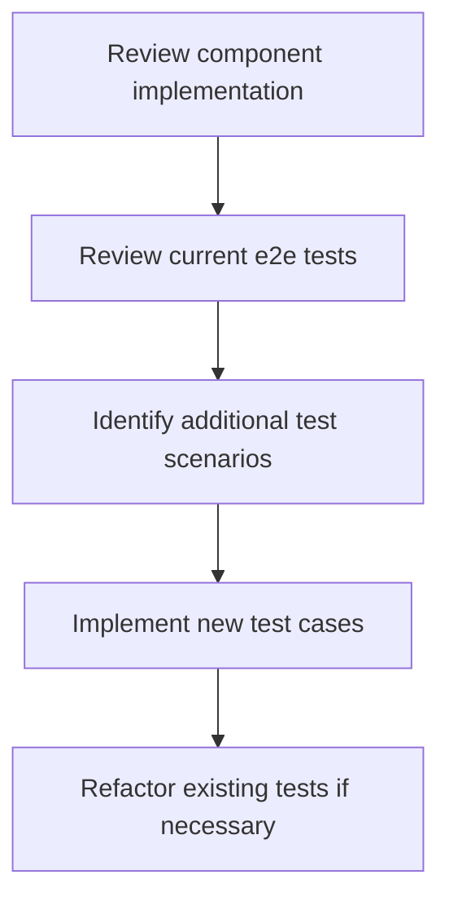

# Enhanced End-to-End Testing Plan for Recommendation Flow

## Overview
This plan aims to enhance the existing end-to-end tests for the recommendation flow by reviewing the component implementation, analyzing current tests, identifying additional test scenarios, and implementing new test cases.

## Steps

1. **Review Component Implementation**
   - Examine the implementation of `SommelierCoordinator`, `RecommendationAgent`, and other relevant agents.
   - Ensure the implementation is correct and aligns with the expected functionality.

2. **Analyze Current End-to-End Tests**
   - Review the existing end-to-end tests in `src/api/__tests__/e2e.test.ts`.
   - Understand the current test coverage and identify any gaps.

3. **Identify Additional Test Scenarios**
   - Based on the component implementation and current test coverage, identify additional test scenarios.
   - Consider various input variations, edge cases, and potential error scenarios.

4. **Implement New Test Cases**
   - Create new test cases to cover the identified scenarios.
   - Ensure the tests are comprehensive, robust, and maintainable.

5. **Refactor Existing Tests (if necessary)**
   - Refactor existing tests to improve their structure, readability, and maintainability.

## Visual Representation

## Next Steps
Please review this plan and confirm if it meets your requirements. Once confirmed, I will proceed to implement the enhanced end-to-end tests.