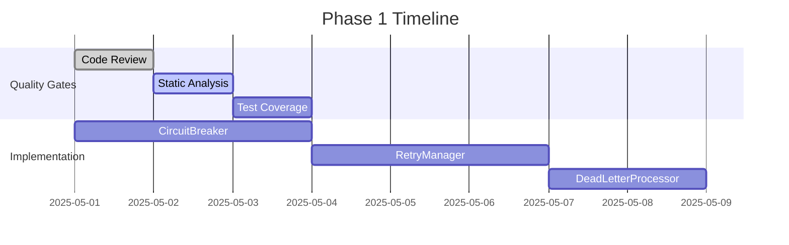
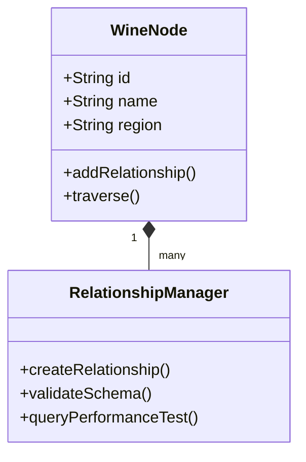
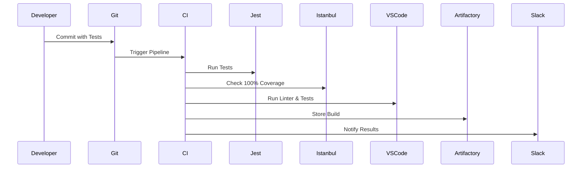
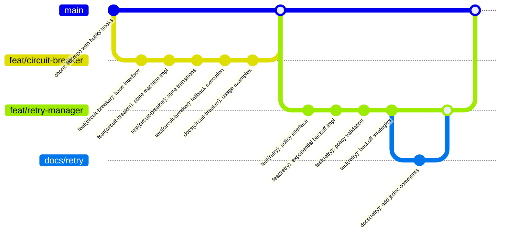
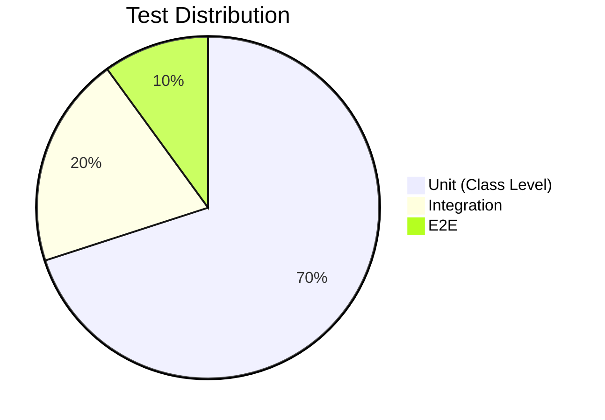

# Wine Recommendation System Implementation Plan

## Phase 1: Core Infrastructure Implementation


### Class Development Sequence
1. **CircuitBreaker Class**
   - SOLID Principles: SRP, OCP
   - Test Cases: State transitions, fallback execution, error validation
   - Required Coverage: 100% branch coverage
   - Dependency: None
   - Implementation Details:
     - Throws "fn is not a function" for invalid function parameters
     - Records failures in state while keeping circuit closed for validation errors
     - 14 passing test cases covering all scenarios

2. **RetryManager Class**  
   - SOLID Principles: OCP, LSP
   - Test Cases: Policy evaluation, backoff strategies
   - Dependency: CircuitBreaker

3. **DeadLetterProcessor**
   - SOLID Principles: SRP, ISP
   - Test Cases: Error classification, replay mechanisms
   - Dependency: RetryManager

## Phase 2: Knowledge Graph Integration


### Quality Enforcement Workflow


## Development Rules
1. **Git Commit Strategy**:


2. **Atomic Commit Standards**:
   - 1 commit = 1 class/test pair
   - Message format: `type(scope): description`
   - Types: feat|fix|docs|test|refactor|chore
   - Scope: class name or component

3. **Class Implementation Checklist**:
   - [ ] Interface defined with TypeScript `interface`
   - [ ] Abstract base class created
   - [ ] Dependency injection via constructor
   - [ ] Immutable configuration objects
   - [ ] 100% test coverage report
   - [ ] Documentation with examples
   - [ ] VSCode lint/test validation passed

2. **Testing Pyramid**:


3. **Tooling Configuration**:
```json
// package.json
{
  "scripts": {
    "test:changed": "jest --onlyChanged --coverage",
    "test:all": "jest --coverage",
    "lint": "eslint . --ext .ts"
  },
  "husky": {
    "hooks": {
      "pre-commit": "npm run test:changed && npm run lint",
      "pre-push": "npm run test:all"
    }
  }
}
```

## Progress Tracking
- **Git Practices**:
  ```mermaid
  gitGraph
      commit
      branch feature/foo
      checkout feature/foo
      commit
      commit
      checkout main
      merge feature/foo
      commit
  ```
- **Branch Strategy**:
  - `main` - Production-ready code only
  - `feature/*` - Single-class implementations
  - `docs/*` - Documentation updates
- **Code Review**:
  - Rebase merging required
  - Linear history enforced
  - PR template:
    ```markdown
    ### Changes
    - [ ] 100% test coverage
    - [ ] SOLID compliance
    - [ ] Documentation updated
    ```
- **IDE Integration**:
  - VSCode ESLint extension for real-time feedback
  - Jest runner integrated in editor
  - Code coverage highlighting
