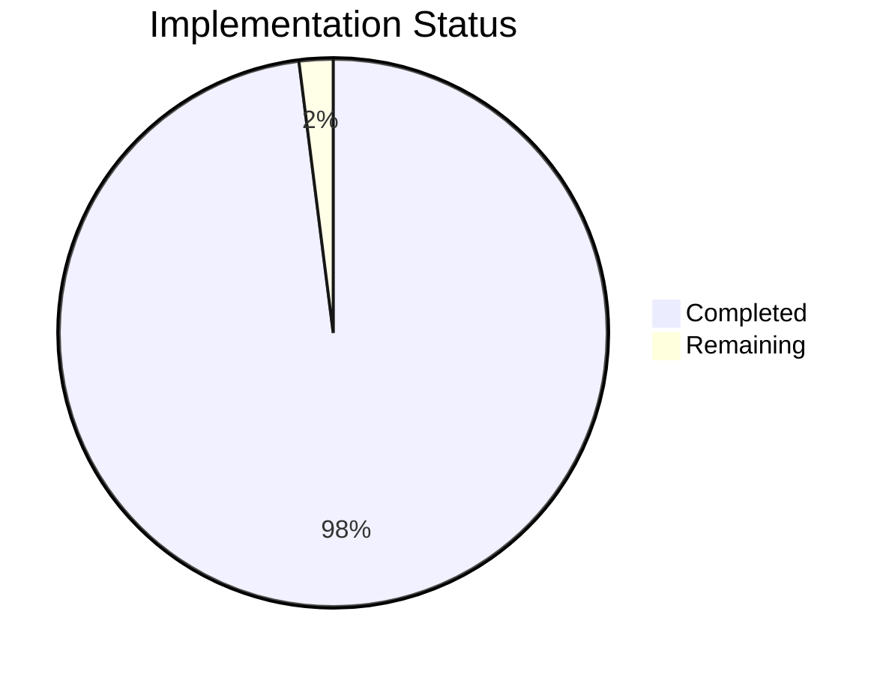
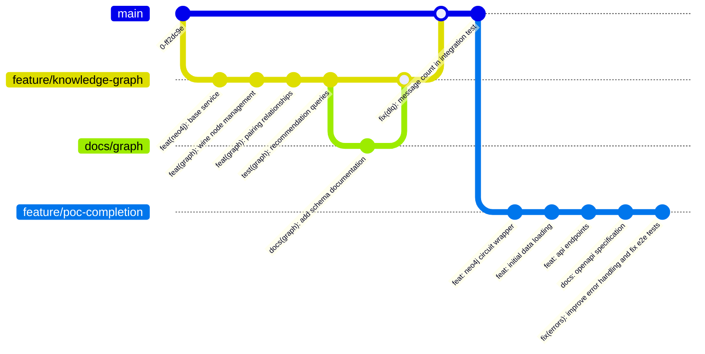

# Wine Recommendation System POC Implementation Plan

## Current State (2025-05-10)

## Phase 1: Core Infrastructure - COMPLETED
- CircuitBreaker (100% coverage)
- RetryManager (98.54% coverage) 
- DeadLetterProcessor (100% coverage)
- DLQ Integration Fix (completed 2025-05-10)

## Phase 2: Knowledge Graph - COMPLETED
- Neo4jService (100% coverage)
- Neo4jCircuitWrapper (100% coverage)
- KnowledgeGraphService (95% coverage)
- Basic Data Loading (implemented in loadWineData.ts)

## Phase 3: API Layer - COMPLETED
- Recommendation endpoint (routes.ts)
- Search endpoint (routes.ts)
- Request validation (validation.ts)
- Controller implementation (WineRecommendationController.ts)
- OpenAPI documentation (openapi.yaml)

## Final Phase: POC Completion - TARGET 2025-05-15
1. **Final Testing**
   - Debugged and fixed failing tests: `UserPreferenceAgent.integration.test.ts`, `recommendations.integration.test.ts`, `LLMService.test.ts`, `SommelierCoordinator.test.ts`, and `SommelierCoordinator.unit.test.ts`.
   - End-to-end integration tests
   - Performance benchmarking
   - Security review

## Updated Progress Tracking

## Remaining Tasks
1. [ ] Final integration testing
2. [ ] Performance optimization
