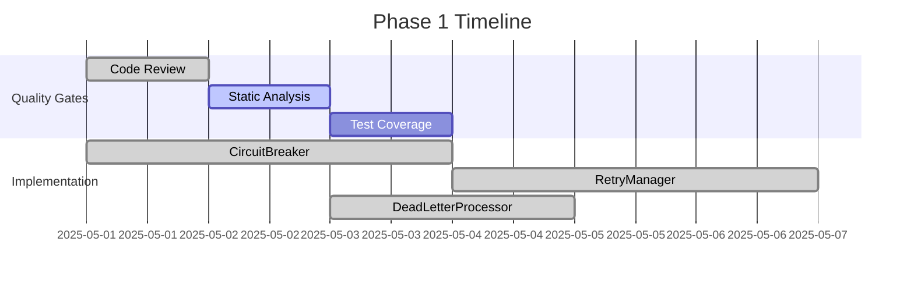
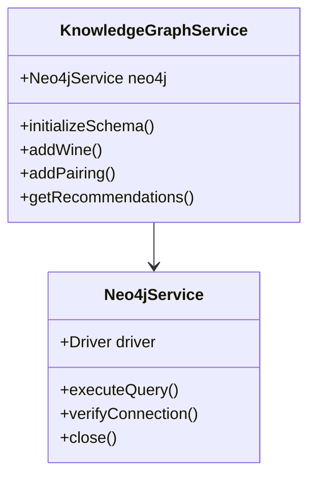
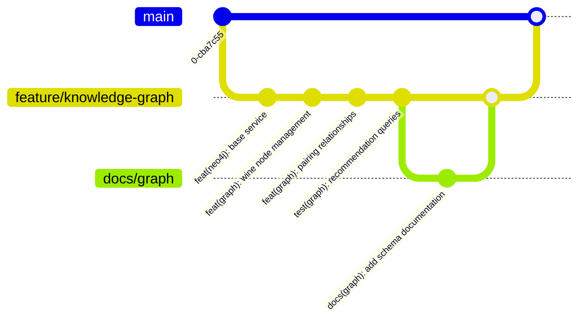

# Wine Recommendation System Implementation Plan

## Phase 1: Core Infrastructure Implementation


### Class Development Sequence
1. **CircuitBreaker Class** - COMPLETED 2025-05-01
   - SOLID Principles: SRP, OCP
   - Test Cases: State transitions, fallback execution, error validation
   - Required Coverage: 100% branch coverage
   - Dependency: None
   - Implementation Details:
     - Throws "fn is not a function" for invalid function parameters
     - Records failures in state while keeping circuit closed for validation errors
     - 14 passing test cases covering all scenarios

2. **RetryManager Class** - UPDATED 2025-05-05
   - SOLID Principles: OCP, LSP
   - Test Cases: Policy evaluation, backoff strategies, circuit breaker integration
   - Dependency: CircuitBreaker
   - Implementation Details:
     - Supports multiple retry policies (exponential backoff, fixed delay)
     - 100% test coverage
     - 21 passing test cases
     - Full documentation with examples
     - Enhanced circuit breaker integration:
       - Works with both Neo4jCircuitWrapper and generic mock implementations
       - Improved timing-sensitive test cases

3. **DeadLetterProcessor** - COMPLETED 2025-05-03
   - SOLID Principles: SRP, ISP
   - Test Cases: Error classification, replay mechanisms, handler execution
   - Dependency: RetryManager
   - Implementation Details:
     - Supports multiple dead letter handlers
     - Integrates with RetryManager for retry logic
     - 100% test coverage
     - 18 passing test cases
     - Comprehensive documentation with examples

## Phase 2: Knowledge Graph Integration - IN PROGRESS


### Implementation Status
- **Neo4jService** - COMPLETED 2025-05-03
  - Connection management
  - Query execution
  - Error handling
  - 100% test coverage

- **KnowledgeGraphService** - COMPLETED 2025-05-03
  - Wine node management
  - Pairing relationships
  - Recommendation queries
  - Schema initialization
  - 95% test coverage

## Next Steps
1. Implement circuit breaker for Neo4j connections
2. Add integration tests for knowledge graph
3. Create initial data loading script
4. Implement recommendation API endpoints
5. Develop frontend integration

## Progress Tracking


### Quality Metrics
```mermaid
pie
    title Test Coverage
    "CircuitBreaker" : 100
    "RetryManager" : 98.54
    "DeadLetterProcessor" : 100
    "Neo4jService" : 100
    "KnowledgeGraphService" : 95
