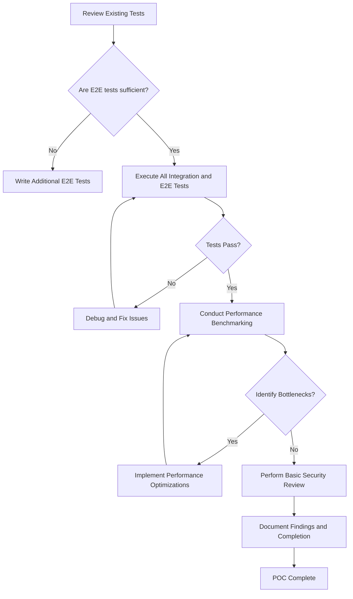

# POC Completion Plan

Based on the `memory-bank/progress.md`, the remaining key areas for the Proof of Concept are final testing and performance optimization.

## Implementation Status (Based on Code Review and Related Plans)

This plan outlines the final steps for completing the Proof of Concept. Based on the code review and the status of related plans, here is the assessment:

**Partially Completed (Steps involving existing code artifacts):**
- Step 1: Finalize Integration and End-to-End Testing (Existing e2e test files are relevant, but completion of identifying gaps, writing *additional* tests, executing *all* tests, and debugging cannot be confirmed through code).

**Remaining:**
- Step 2: Performance Benchmarking and Optimization (No code evidence found).
- Step 3: Basic Security Review (No code evidence of a dedicated review process or comprehensive checks found).
- Step 4: Documentation and Completion (Updating `progress.md` and summarizing findings are pending).

Overall, this POC completion plan appears to be largely **Remaining**.

**Detailed Steps:**

1.  **Finalize Integration and End-to-End Testing:**
    *   Review the existing integration and end-to-end tests (e.g., in `src/api/__tests__/e2e.test.ts`).
    *   Identify any gaps in test coverage based on the implemented features (Recommendation and Search endpoints, validation, etc.).
    *   Write additional tests as needed to ensure comprehensive coverage of critical paths and edge cases.
    *   Execute all integration and end-to-end tests to confirm system stability and correctness.
    *   Debug and fix any issues identified during testing.

2.  **Performance Benchmarking and Optimization:**
    *   Define key performance indicators (KPIs) for the system (e.g., response time for recommendations, throughput).
    *   Set up and run performance benchmarks to measure the system's performance under various load conditions.
    *   Analyze the benchmarking results to identify performance bottlenecks (e.g., in Neo4j queries, agent processing, API handling).
    *   Implement targeted optimizations to address identified bottlenecks.
    *   Re-run benchmarks to verify the effectiveness of optimizations.

3.  **Basic Security Review (Optional but Recommended for POC):**
    *   Conduct a basic review of the API endpoints for common security vulnerabilities (e.g., input sanitization, rate limiting - which seems to have some tests in `src/server/__tests__/rateLimiter.test.ts`).
    *   Ensure sensitive information is handled appropriately.

4.  **Documentation and Completion:**
    *   Update the `memory-bank/progress.md` file to reflect the completed testing and optimization steps.
    *   Summarize the findings from performance benchmarking and security review.
    *   Declare the POC complete.